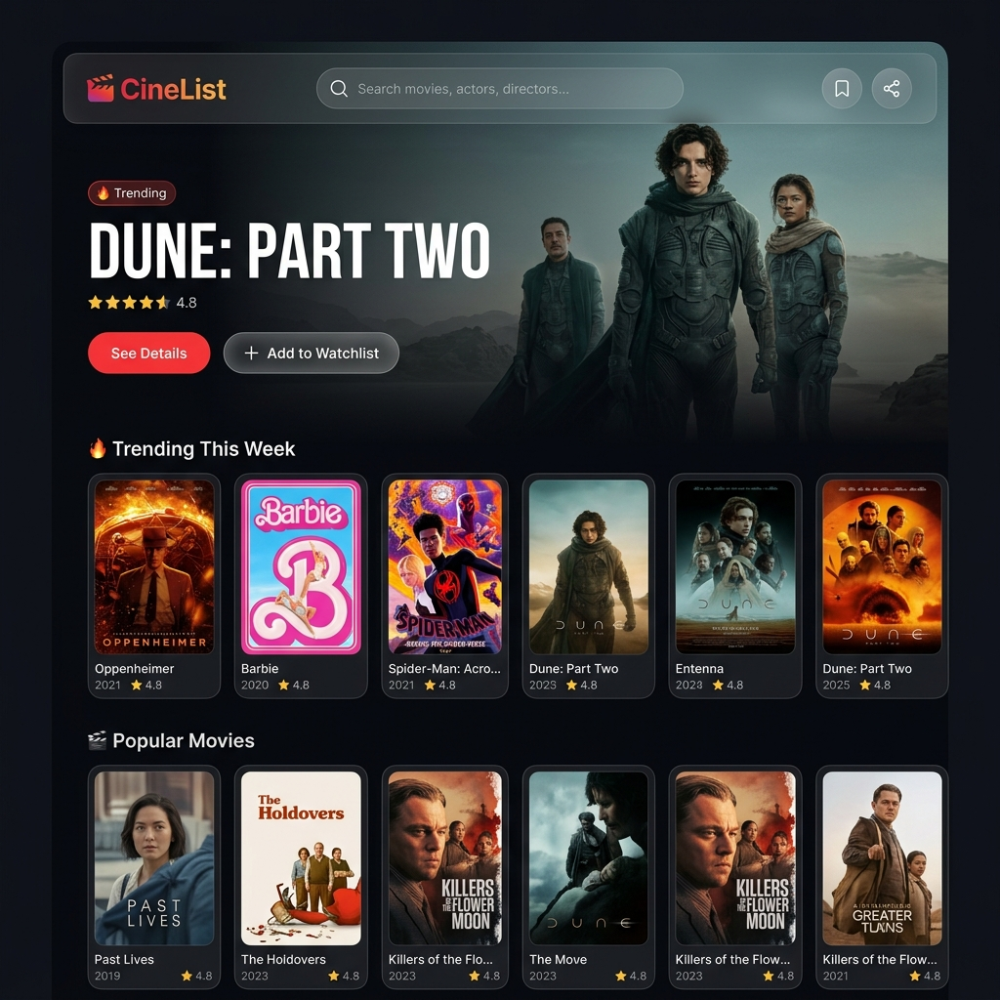
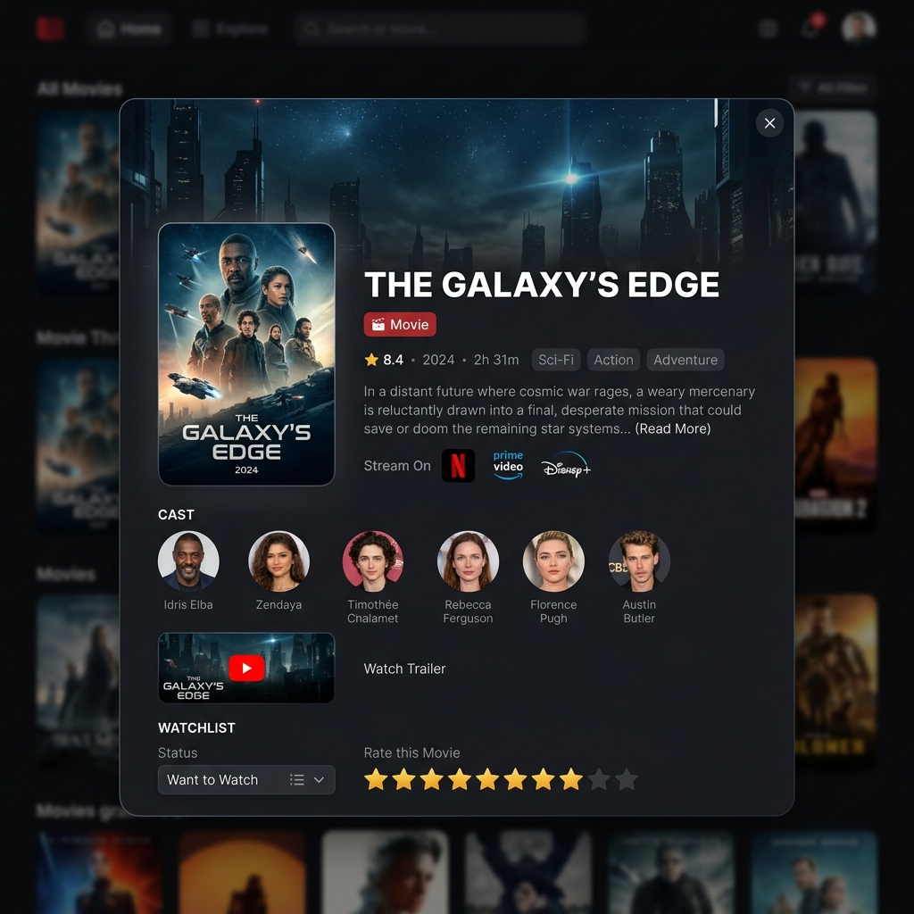
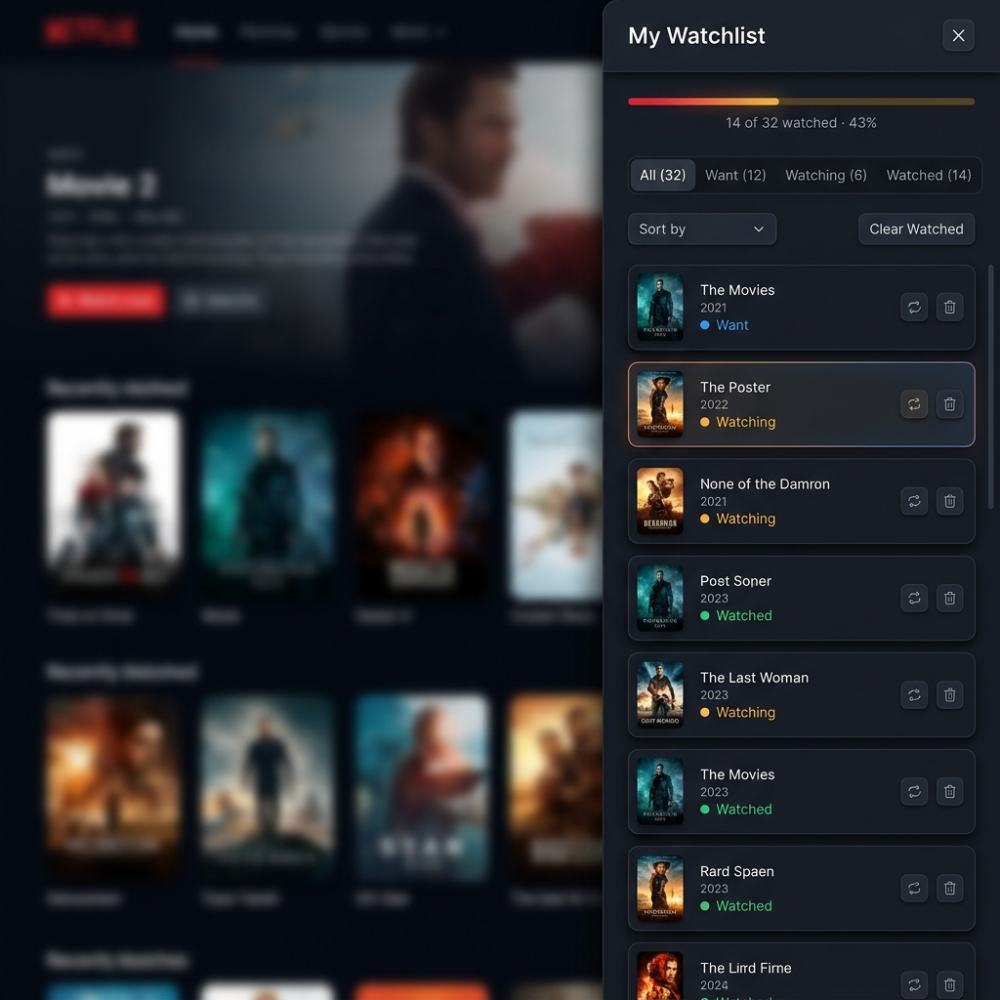

# CineList 🎬

> A premium, feature-rich **Movie & TV Watchlist** app powered by the [TMDB API](https://www.themoviedb.org/documentation/api). Discover trending content, track what you watch, rate titles, find streaming providers, and share your list — all with zero backend.

[](https://alamulord.github.io/CineList/)
[](https://www.themoviedb.org)
[](https://developer.mozilla.org/en-US/docs/Web/JavaScript)
[](/)

---

## 📸 Screenshots

### Hero & Discovery

*Trending hero carousel with ken-burns animation, horizontal content rails, and genre filter pills*

### Movie / TV Detail Modal

*Full detail overlay with cast, trailer, streaming providers, and personal rating*

### Watchlist Drawer

*Slide-out watchlist with progress tracking, status tabs, and sort controls*

---

## ✨ Features

| Feature | Details |
|---|---|
| 🔍 **Smart Search** | 350ms debounced search with `AbortController` — cancels stale requests |
| 🖼️ **Image Optimization** | Responsive TMDB image sizes (`w185` → `w1280`) via `IntersectionObserver` lazy loading |
| 🎬 **Rich Details** | Cast, genres, runtime, trailers (YouTube), TMDB rating |
| 📺 **Streaming Providers** | Shows Netflix, Prime, Disney+ etc. for your region via TMDB `/watch/providers` |
| 📋 **Watchlist** | Add, remove, cycle status (Want → Watching → Watched) |
| ⭐ **Personal Rating** | Rate titles 1–10 with interactive star UI |
| 📝 **Notes** | Add personal notes to any title |
| 📊 **Progress Bar** | Visual progress of how much of your list you've watched |
| 🔗 **Shareable Lists** | Base64-URL encode your watchlist into a shareable link |
| 🎨 **Premium UI** | Glassmorphism, ken-burns hero, micro-animations, skeleton loaders |
| 💾 **Zero Backend** | All data stored in `localStorage` — no server needed |
| ♿ **Accessible** | ARIA roles, keyboard navigation, focus management, reduced-motion support |

---

## 🚀 Getting Started

### 1. Clone the repo

```bash
git clone https://github.com/alamulord/CineList.git
cd CineList
```

### 2. Get a free TMDB API key

1. Create a free account at [themoviedb.org](https://www.themoviedb.org/signup)
2. Go to **Settings → API**
3. Request an API key — copy your **API Read Access Token** (starts with `eyJ…`)

### 3. Add your token

Open `js/api.js` and replace the placeholder:

```js
const CONFIG = {
  BASE_URL: 'https://api.themoviedb.org/3',
  BEARER_TOKEN: 'eyJ...your_token_here',   // ← paste here
  IMAGE_BASE: 'https://image.tmdb.org/t/p/',
};
```

### 4. Open in browser

```bash
# No build step needed — just open index.html
start index.html        # Windows
open index.html         # macOS
xdg-open index.html     # Linux
```

> **Tip:** Use a local server (e.g. VS Code Live Server) if you encounter CORS issues with `file://` protocol.

---

## 📁 Project Structure

```
CineList/
├── index.html              # App shell (semantic HTML5, ARIA)
├── css/
│   ├── index.css           # Design tokens, layout, header, hero
│   ├── components.css      # Cards, modal, dropdown, watchlist items
│   └── animations.css      # Keyframes, micro-animations
├── js/
│   ├── api.js              # TMDB API client + image helpers
│   ├── store.js            # localStorage state manager
│   ├── ui.js               # DOM rendering (cards, toasts, stars)
│   ├── search.js           # Debounced search + dropdown
│   ├── watchlist.js        # Drawer controller (tabs, sort, progress)
│   ├── share.js            # URL-based list sharing (Base64 encode/decode)
│   └── main.js             # App entry point & orchestrator
└── assets/
    └── placeholder.svg     # Fallback poster image
```

---

## 🛠️ Tech Stack

- **HTML5** — Semantic structure, ARIA accessibility
- **Vanilla CSS** — Design tokens, glassmorphism, CSS Grid, animations
- **Vanilla JS (ES Modules)** — No frameworks, no build tools
- **TMDB API v3** — Movies, TV, images, streaming providers
- **localStorage** — Client-side persistence
- **Google Fonts** — Inter + Outfit

---

## 🔑 Key Technical Highlights

### Debounced Search with AbortController
```js
const doSearch = debounce(async (query) => {
  abortController?.abort();                          // cancel previous request
  abortController = new AbortController();
  const data = await searchMulti(query, { signal: abortController.signal });
  renderDropdown(data.results);
}, 350);
```

### Image Optimization
```js
// Pick the right TMDB size for each context:
THUMB:   w185    // search dropdown
CARD:    w342    // poster cards
POSTER:  w500    // modal detail
BACK_LG: w1280   // hero backdrop
```

### Shareable Lists
```js
// Encode: watchlist JSON → Base64-URL → ?list= param → clipboard
// Decode: detect ?list= on load → show import banner
```

---

## 📋 Watchlist Status Flow

```
➕ Add  →  🔖 Want to Watch  →  ▶️ Watching  →  ✅ Watched
                    ↑_____________________________________|
                         (cycle button loops back)
```

---

## 🤝 Contributing

Pull requests are welcome! For major changes, please open an issue first.

1. Fork the repo
2. Create your feature branch: `git checkout -b feature/amazing-feature`
3. Commit your changes: `git commit -m 'Add amazing feature'`
4. Push: `git push origin feature/amazing-feature`
5. Open a Pull Request

---

## 📄 License

MIT — see [LICENSE](LICENSE) for details.

---

> This product uses the TMDB API but is not endorsed or certified by TMDB.
> 
